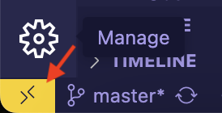
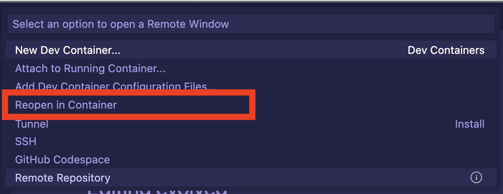

# hugo-with-dev-container

This project aims to provide you with a minimal configuration to set up Dev Containers for your Hugo website.

I have written a guide on how to create a Dev Container using the VS Code Extension for a Hugo project. You can find it at [https://theindiecoder/posts/dev-container-setup-for-hugo/](https://theindiecoder/posts/dev-container-setup-for-hugo/).

## Prerequisites
Whether you are a macOS user or a Windows user, you need to have the following installed:
- Visual Studio Code
- VS Code Dev Containers extension
- Docker Desktop

I have prepared this guide as a macOS user, so I have not tried running Dev Containers on Windows or Linux. If you are a Windows or Linux user, please refer to the Visual Studio Code [documentation](https://code.visualstudio.com/docs/devcontainers/containers#installation) for installation instructions.
 
## Open the project in a container

1. Fork this repository.

2. Open the repository with VS Code. 

3. In the bottom left corner of your VS Code window, click on the `Dev Container Extension` button.

4. A setup wizard will pop up, in the middle of the window. Select the `Reopen in Container` option. 

You are now good to develop your Hugo site, using Dev Containers! 🚀